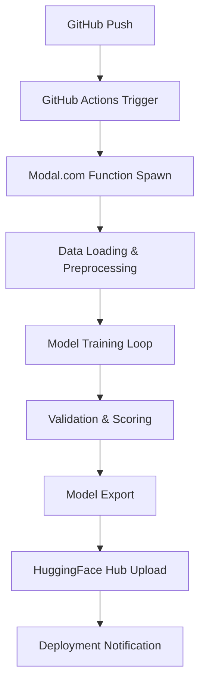

# SISI LOLA PROJECT - SYSTEM ARCHITECTURE

## 🏗️ ARCHITECTURAL OVERVIEW

**Architecture Version**: 2.0.0  
**Last Updated**: November 22, 2024  
**Architecture Type**: Microservices with ML Pipeline Integration  
**Deployment Model**: Hybrid Cloud-Local Development  

---

## 🎯 SYSTEM DESIGN PRINCIPLES

### **Core Architectural Principles**
1. **Modularity**: Independent, loosely-coupled components
2. **Scalability**: Horizontal scaling for training and inference
3. **Reliability**: Fault-tolerant with automated recovery
4. **Performance**: Optimized for real-time AI interactions
5. **Maintainability**: Clear separation of concerns and documentation

### **Design Patterns Implemented**
- **Pipeline Pattern**: ML training and asset generation workflows
- **Repository Pattern**: Model and asset storage management
- **Observer Pattern**: Training progress monitoring and notifications
- **Factory Pattern**: Dynamic model and asset creation
- **Strategy Pattern**: Multiple training and generation approaches

---

## 🏛️ HIGH-LEVEL ARCHITECTURE

```
┌─────────────────────────────────────────────────────────────────┐
│                    SISI LOLA VR/AI SYSTEM                      │
├─────────────────────────────────────────────────────────────────┤
│  ┌─────────────────┐  ┌─────────────────┐  ┌─────────────────┐ │
│  │   CONTENT GEN   │  │   ML TRAINING   │  │   VR RUNTIME    │ │
│  │    PIPELINE     │  │    PIPELINE     │  │    SYSTEM       │ │
│  └─────────────────┘  └─────────────────┘  └─────────────────┘ │
├─────────────────────────────────────────────────────────────────┤
│  ┌─────────────────┐  ┌─────────────────┐  ┌─────────────────┐ │
│  │  API GATEWAY    │  │  PERSONALITY    │  │   ASSET STORE   │ │
│  │   & ROUTING     │  │    ENGINE       │  │   & DELIVERY    │ │
│  └─────────────────┘  └─────────────────┘  └─────────────────┘ │
├─────────────────────────────────────────────────────────────────┤
│  ┌─────────────────┐  ┌─────────────────┐  ┌─────────────────┐ │
│  │  CLOUD INFRA    │  │  LOCAL DEV ENV  │  │  MONITORING &   │ │
│  │  (Modal.com)    │  │  (Python/Git)   │  │   ANALYTICS     │ │
│  └─────────────────┘  └─────────────────┘  └─────────────────┘ │
└─────────────────────────────────────────────────────────────────┘
```

---

## 🔧 COMPONENT ARCHITECTURE

### **1. ML Training Pipeline**

#### **Training Infrastructure**
```python
# Modal.com Cloud Training Architecture
@app.function(
    image=training_image,
    gpu="A100",
    timeout=3600,
    secrets=[modal.Secret.from_name("huggingface-secret")]
)
def train_personality_model(config: TrainingConfig):
    """
    Cloud-based personality model training
    - GPU: NVIDIA A100 (40GB VRAM)
    - Framework: PyTorch + HuggingFace Transformers
    - Duration: 1-3 hours depending on dataset size
    - Output: Fine-tuned personality model
    """
```

#### **Training Components**
- **Data Preprocessing**: Nigerian Pidgin text normalization
- **Model Architecture**: GPT-2 based with personality layers
- **Training Loop**: Custom loss functions for personality consistency
- **Validation**: Automated personality trait scoring
- **Deployment**: Automatic HuggingFace Hub upload

#### **Training Workflow**


### **2. Content Generation Pipeline**

#### **Asset Generation Architecture**
```
┌─────────────────────────────────────────────────────────────┐
│                 ASSET GENERATION PIPELINE                  │
├─────────────────────────────────────────────────────────────┤
│  Input: MASTER_ASSET_MANIFEST.csv (200+ items)            │
│  ├── Avatar DNA (60 items)                                │
│  ├── VR Environments (60 items)                           │
│  ├── Media Assets (50 items)                              │
│  ├── Audio Core (30 items)                                │
│  └── Branding Artifacts (20 items)                        │
├─────────────────────────────────────────────────────────────┤
│  Processing: AI Generation Tools                           │
│  ├── Midjourney v6 (Images)                               │
│  ├── Runway Gen-3 (Videos)                                │
│  ├── ElevenLabs (Voice)                                    │
│  ├── Stable Diffusion XL (Alternative Images)             │
│  └── Skybox AI (360° Environments)                        │
├─────────────────────────────────────────────────────────────┤
│  Output: Organized Asset Library                           │
│  ├── Quality Validation                                    │
│  ├── Brand Consistency Check                               │
│  ├── Technical Specification Compliance                    │
│  └── Automated File Organization                           │
└─────────────────────────────────────────────────────────────┘
```

#### **Generation Workflow**
1. **Manifest Processing**: CSV parsing and prompt extraction
2. **Tool Selection**: Optimal AI tool for each asset type
3. **Batch Generation**: Efficient bulk processing
4. **Quality Control**: Automated validation and scoring
5. **Asset Organization**: Structured file system placement

### **3. Personality Engine**

#### **Personality Architecture**
```python
class SisiLolaPersonality:
    """
    Core personality engine with trait-based responses
    """
    def __init__(self):
        self.traits = {
            'confidence': 8.5,
            'humor': 8.5,
            'charisma': 9.0,
            'authenticity': 9.0,
            'empowerment': 9.0
        }
        self.language_mix = ['english', 'nigerian_pidgin']
        self.catchphrases = [
            "Omo see gobe!",
            "E choke!",
            "Las las, we go dey alright!"
        ]
    
    def generate_response(self, context: str) -> str:
        """
        Generate personality-consistent response
        """
        # Trait-weighted response generation
        # Cultural context integration
        # Humor injection based on confidence level
        # Pidgin English integration
```

#### **Personality Components**
- **Trait Scoring System**: Quantified personality characteristics
- **Cultural Context Engine**: Nigerian cultural references and humor
- **Language Mixing Logic**: English-Pidgin code-switching patterns
- **Emotional State Management**: Dynamic personality adjustments
- **Response Generation**: Context-aware personality-driven outputs

### **4. VR Runtime System**

#### **VR Integration Architecture**
```
┌─────────────────────────────────────────────────────────────┐
│                    VR RUNTIME SYSTEM                       │
├─────────────────────────────────────────────────────────────┤
│  ┌─────────────────┐  ┌─────────────────┐  ┌─────────────┐ │
│  │  UNREAL ENGINE  │  │   METAHUMAN     │  │  SKYBOX AI  │ │
│  │      5.0        │  │   CHARACTER     │  │ ENVIRONMENTS│ │
│  │   (VR Engine)   │  │   SYSTEM        │  │  (360° VR)  │ │
│  └─────────────────┘  └─────────────────┘  └─────────────┘ │
├─────────────────────────────────────────────────────────────┤
│  ┌─────────────────┐  ┌─────────────────┐  ┌─────────────┐ │
│  │   AI VOICE      │  │  PERSONALITY    │  │  REAL-TIME  │ │
│  │  SYNTHESIS      │  │    ENGINE       │  │  RENDERING  │ │
│  │ (ElevenLabs)    │  │  (ML Models)    │  │  PIPELINE   │ │
│  └─────────────────┘  └─────────────────┘  └─────────────┘ │
└─────────────────────────────────────────────────────────────┘
```

#### **VR Components**
- **3D Character Rendering**: MetaHuman-based Sisi Lola avatar
- **Environment Management**: Dynamic 360° VR environments
- **Voice Synthesis**: Real-time AI voice generation
- **Interaction System**: Natural language conversation interface
- **Performance Optimization**: 90+ FPS VR rendering

---

## 🔄 DATA FLOW ARCHITECTURE

### **Training Data Flow**
```
Nigerian Content Sources
         ↓
    Data Collection
         ↓
   Text Preprocessing
         ↓
   Dataset Creation
         ↓
  Modal.com Training
         ↓
   Model Validation
         ↓
 HuggingFace Upload
         ↓
  Production Deployment
```

### **Asset Generation Flow**
```
MASTER_ASSET_MANIFEST.csv
         ↓
   Prompt Extraction
         ↓
   AI Tool Selection
         ↓
   Batch Generation
         ↓
  Quality Validation
         ↓
   File Organization
         ↓
   Asset Library Update
```

### **Runtime Interaction Flow**
```
User Input (VR/Voice/Text)
         ↓
   Context Analysis
         ↓
 Personality Processing
         ↓
  Response Generation
         ↓
   Voice Synthesis
         ↓
  VR Avatar Animation
         ↓
   User Experience
```

---

## 🛡️ SECURITY ARCHITECTURE

### **Security Layers**
1. **API Security**: Token-based authentication for all external services
2. **Data Privacy**: No personal data storage, ephemeral processing
3. **Model Security**: Encrypted model storage and transmission
4. **Infrastructure Security**: Modal.com and GitHub security compliance
5. **Access Control**: Role-based permissions for development team

### **Security Implementation**
```python
# API Token Management
class SecureTokenManager:
    def __init__(self):
        self.tokens = {
            'huggingface': os.getenv('HF_TOKEN'),
            'modal': os.getenv('MODAL_TOKEN'),
            'elevenlabs': os.getenv('ELEVENLABS_API_KEY'),
            'cohere': os.getenv('COHERE_API_KEY')
        }
    
    def get_token(self, service: str) -> str:
        """Secure token retrieval with validation"""
        if service not in self.tokens:
            raise SecurityError(f"Unknown service: {service}")
        return self.tokens[service]
```

---

## 📊 PERFORMANCE ARCHITECTURE

### **Performance Targets**
- **Training Speed**: <2 hours for full personality model
- **Inference Latency**: <200ms for personality response
- **Asset Generation**: <1 hour average per asset
- **VR Rendering**: 90+ FPS in VR environments
- **System Availability**: 99.9% uptime target

### **Optimization Strategies**
1. **GPU Acceleration**: NVIDIA A100 for training, optimized inference
2. **Caching**: Model and asset caching for faster access
3. **Batch Processing**: Efficient bulk operations
4. **Load Balancing**: Distributed processing for high demand
5. **Resource Management**: Dynamic scaling based on usage

### **Performance Monitoring**
```python
class PerformanceMonitor:
    def __init__(self):
        self.metrics = {
            'training_time': [],
            'inference_latency': [],
            'generation_speed': [],
            'system_resources': []
        }
    
    def track_performance(self, operation: str, duration: float):
        """Real-time performance tracking"""
        self.metrics[operation].append({
            'timestamp': datetime.now(),
            'duration': duration,
            'status': 'success'
        })
```

---

## 🔧 DEPLOYMENT ARCHITECTURE

### **Development Environment**
- **Local Development**: Python 3.10+, Git, VS Code
- **Version Control**: GitHub with automated workflows
- **Testing**: Automated unit and integration tests
- **Documentation**: Comprehensive technical documentation

### **Staging Environment**
- **Cloud Training**: Modal.com with GPU acceleration
- **Model Storage**: HuggingFace Hub with version control
- **Asset Storage**: Organized file system with cloud backup
- **Monitoring**: Real-time training and generation monitoring

### **Production Environment**
- **VR Deployment**: Unreal Engine 5 with optimized assets
- **AI Inference**: Fast model serving with caching
- **Content Delivery**: CDN for asset distribution
- **Analytics**: User interaction and performance analytics

### **Deployment Pipeline**
```yaml
# GitHub Actions Deployment
name: Production Deploy
on:
  push:
    branches: [main]
    
jobs:
  deploy:
    runs-on: ubuntu-latest
    steps:
      - name: Train Models
        run: modal run ml_training/modal_train.py
      - name: Generate Assets
        run: python asset_generation/batch_generate.py
      - name: Deploy to Production
        run: ./deploy_production.sh
```

---

## 🔮 FUTURE ARCHITECTURE EVOLUTION

### **Planned Enhancements**
1. **Microservices Migration**: Break monolith into independent services
2. **Kubernetes Deployment**: Container orchestration for scalability
3. **Real-time Analytics**: Advanced user behavior tracking
4. **Multi-language Support**: Expand beyond English and Pidgin
5. **Edge Computing**: Local inference for reduced latency

### **Scalability Roadmap**
- **Phase 1**: Single personality, single language
- **Phase 2**: Multiple personality variants
- **Phase 3**: Multi-language support
- **Phase 4**: Real-time learning and adaptation
- **Phase 5**: Distributed global deployment

---

*This architecture documentation is continuously updated to reflect system evolution and technical improvements.*