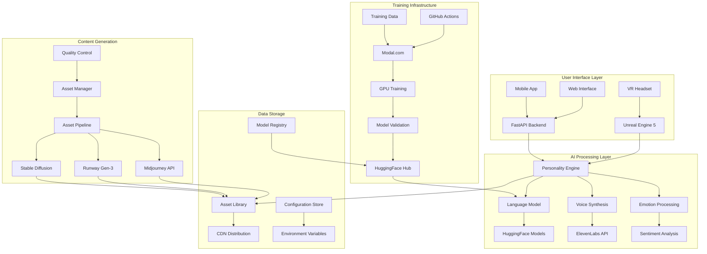
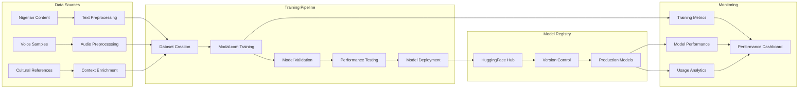
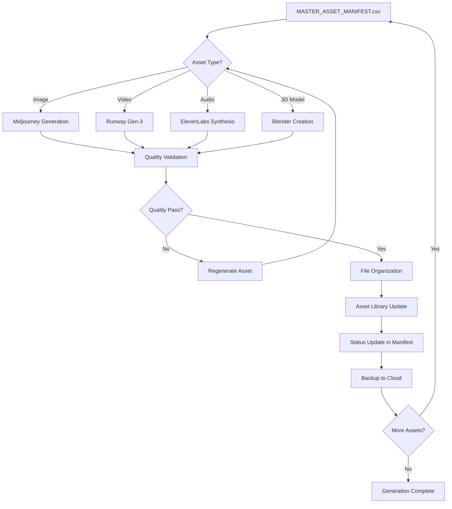
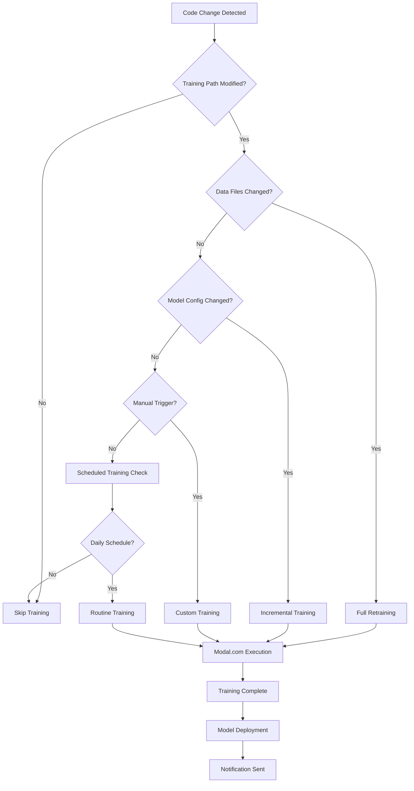
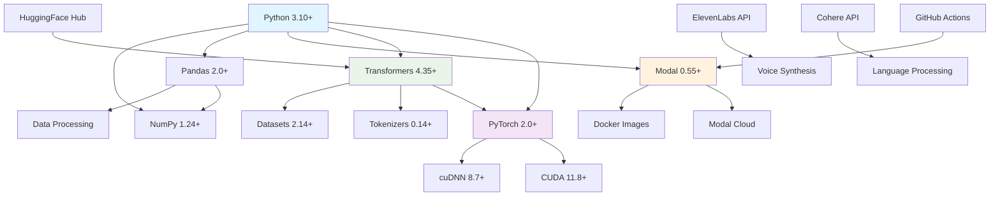
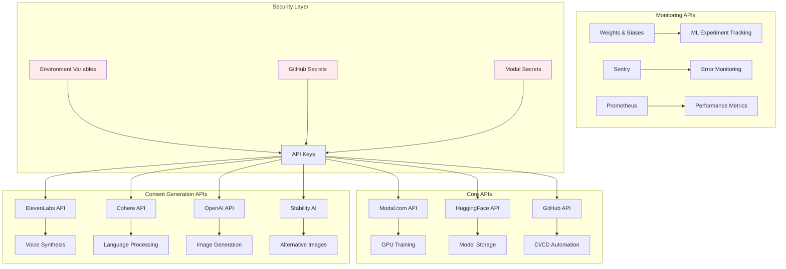

# SISI LOLA PROJECT - VISUALIZATION MASTER INDEX

## 🎨 VISUALIZATION OVERVIEW

**Visualization Version**: 2.0.0  
**Last Updated**: November 22, 2024  
**Visualization Tools**: Mermaid, PlantUML, D3.js, Plotly, Graphviz  
**Output Formats**: SVG, PNG, PDF, Interactive HTML  

---

## 📊 VISUALIZATION CATEGORIES

### **01_ARCHITECTURE_DIAGRAMS**
High-level system architecture and component relationships

### **02_FLOW_CHARTS**
Process flows, workflows, and decision trees

### **03_DEPENDENCY_GRAPHS**
Package dependencies, API relationships, and integration maps

### **04_PERFORMANCE_CHARTS**
Performance metrics, benchmarks, and monitoring dashboards

---

## 🏗️ SYSTEM ARCHITECTURE VISUALIZATIONS

### **High-Level System Architecture**


### **ML Training Pipeline Architecture**


---

## 🔄 PROCESS FLOW VISUALIZATIONS

### **Asset Generation Workflow**


### **Training Trigger Decision Tree**


---

## 🕸️ DEPENDENCY RELATIONSHIP GRAPHS

### **Core Package Dependencies**


### **API Integration Map**


---

## 📈 PERFORMANCE VISUALIZATION TEMPLATES

### **Training Performance Dashboard**
```python
# Plotly dashboard for training metrics
import plotly.graph_objects as go
from plotly.subplots import make_subplots

def create_training_dashboard(metrics_data):
    """Create interactive training performance dashboard"""
    
    fig = make_subplots(
        rows=2, cols=2,
        subplot_titles=('Training Loss', 'Validation Accuracy', 
                       'GPU Utilization', 'Training Speed'),
        specs=[[{"secondary_y": True}, {"secondary_y": True}],
               [{"secondary_y": False}, {"secondary_y": False}]]
    )
    
    # Training Loss
    fig.add_trace(
        go.Scatter(
            x=metrics_data['epochs'],
            y=metrics_data['train_loss'],
            name='Training Loss',
            line=dict(color='red', width=2)
        ),
        row=1, col=1
    )
    
    # Validation Accuracy
    fig.add_trace(
        go.Scatter(
            x=metrics_data['epochs'],
            y=metrics_data['val_accuracy'],
            name='Validation Accuracy',
            line=dict(color='blue', width=2)
        ),
        row=1, col=2
    )
    
    # GPU Utilization
    fig.add_trace(
        go.Bar(
            x=metrics_data['training_sessions'],
            y=metrics_data['gpu_utilization'],
            name='GPU Utilization %',
            marker_color='green'
        ),
        row=2, col=1
    )
    
    # Training Speed
    fig.add_trace(
        go.Scatter(
            x=metrics_data['epochs'],
            y=metrics_data['samples_per_second'],
            name='Samples/Second',
            line=dict(color='orange', width=2),
            fill='tonexty'
        ),
        row=2, col=2
    )
    
    fig.update_layout(
        title_text="Sisi Lola Training Performance Dashboard",
        showlegend=True,
        height=600
    )
    
    return fig

# Usage example
dashboard = create_training_dashboard(training_metrics)
dashboard.write_html("training_dashboard.html")
```

### **API Performance Monitoring**
```python
# Real-time API performance visualization
import plotly.express as px
import pandas as pd

def create_api_performance_chart(api_metrics):
    """Create API performance monitoring chart"""
    
    df = pd.DataFrame(api_metrics)
    
    # Response time distribution
    fig_response = px.histogram(
        df, x='response_time', color='api_service',
        title='API Response Time Distribution',
        labels={'response_time': 'Response Time (ms)', 'count': 'Frequency'}
    )
    
    # Error rate over time
    fig_errors = px.line(
        df.groupby(['timestamp', 'api_service'])['error_rate'].mean().reset_index(),
        x='timestamp', y='error_rate', color='api_service',
        title='API Error Rate Over Time'
    )
    
    # Cost analysis
    fig_cost = px.bar(
        df.groupby('api_service')['cost'].sum().reset_index(),
        x='api_service', y='cost',
        title='API Usage Costs by Service'
    )
    
    return fig_response, fig_errors, fig_cost
```

---

## 🎯 INTERACTIVE VISUALIZATION TOOLS

### **Mermaid Diagram Generator**
```python
class MermaidDiagramGenerator:
    def __init__(self):
        self.diagrams = {}
    
    def generate_architecture_diagram(self, components):
        """Generate system architecture diagram"""
        mermaid_code = "graph TB\n"
        
        for component in components:
            mermaid_code += f"    {component['id']}[{component['name']}]\n"
        
        for connection in components:
            for target in connection.get('connects_to', []):
                mermaid_code += f"    {connection['id']} --> {target}\n"
        
        return mermaid_code
    
    def generate_flowchart(self, process_steps):
        """Generate process flowchart"""
        mermaid_code = "flowchart TD\n"
        
        for step in process_steps:
            shape = self.get_shape_for_type(step['type'])
            mermaid_code += f"    {step['id']}{shape[0]}{step['name']}{shape[1]}\n"
        
        for step in process_steps:
            for next_step in step.get('next', []):
                condition = step.get('condition', '')
                if condition:
                    mermaid_code += f"    {step['id']} -->|{condition}| {next_step}\n"
                else:
                    mermaid_code += f"    {step['id']} --> {next_step}\n"
        
        return mermaid_code
    
    def get_shape_for_type(self, step_type):
        """Get Mermaid shape syntax for step type"""
        shapes = {
            'process': ['[', ']'],
            'decision': ['{', '}'],
            'start_end': ['([', '])'],
            'data': ['[(', ')]']
        }
        return shapes.get(step_type, ['[', ']'])
```

### **D3.js Integration for Advanced Visualizations**
```javascript
// D3.js dependency graph visualization
class DependencyGraphVisualizer {
    constructor(containerId) {
        this.container = d3.select(`#${containerId}`);
        this.width = 800;
        this.height = 600;
        this.svg = this.container.append('svg')
            .attr('width', this.width)
            .attr('height', this.height);
    }
    
    renderDependencyGraph(dependencies) {
        // Create force simulation
        const simulation = d3.forceSimulation(dependencies.nodes)
            .force('link', d3.forceLink(dependencies.links).id(d => d.id))
            .force('charge', d3.forceManyBody().strength(-300))
            .force('center', d3.forceCenter(this.width / 2, this.height / 2));
        
        // Create links
        const link = this.svg.append('g')
            .selectAll('line')
            .data(dependencies.links)
            .enter().append('line')
            .attr('stroke', '#999')
            .attr('stroke-opacity', 0.6)
            .attr('stroke-width', d => Math.sqrt(d.value));
        
        // Create nodes
        const node = this.svg.append('g')
            .selectAll('circle')
            .data(dependencies.nodes)
            .enter().append('circle')
            .attr('r', d => d.size || 5)
            .attr('fill', d => this.getColorForType(d.type))
            .call(d3.drag()
                .on('start', this.dragstarted)
                .on('drag', this.dragged)
                .on('end', this.dragended));
        
        // Add labels
        const label = this.svg.append('g')
            .selectAll('text')
            .data(dependencies.nodes)
            .enter().append('text')
            .text(d => d.name)
            .attr('font-size', '12px')
            .attr('dx', 15)
            .attr('dy', 4);
        
        // Update positions on simulation tick
        simulation.on('tick', () => {
            link
                .attr('x1', d => d.source.x)
                .attr('y1', d => d.source.y)
                .attr('x2', d => d.target.x)
                .attr('y2', d => d.target.y);
            
            node
                .attr('cx', d => d.x)
                .attr('cy', d => d.y);
            
            label
                .attr('x', d => d.x)
                .attr('y', d => d.y);
        });
    }
    
    getColorForType(type) {
        const colors = {
            'core': '#ff6b6b',
            'ml': '#4ecdc4',
            'api': '#45b7d1',
            'dev': '#96ceb4',
            'security': '#ffeaa7'
        };
        return colors[type] || '#ddd';
    }
}
```

---

## 📊 AUTOMATED VISUALIZATION GENERATION

### **GitHub Actions Visualization Workflow**
```yaml
name: Generate Visualizations

on:
  push:
    branches: [main]
    paths: 
      - 'ml_training/**'
      - '00_DOCUMENTATION_MASTER/**'
  workflow_dispatch:

jobs:
  generate-visuals:
    runs-on: ubuntu-latest
    steps:
      - uses: actions/checkout@v4
      
      - name: Setup Python
        uses: actions/setup-python@v5
        with:
          python-version: '3.10'
      
      - name: Install visualization tools
        run: |
          pip install plotly pandas matplotlib seaborn
          npm install -g @mermaid-js/mermaid-cli
      
      - name: Generate architecture diagrams
        run: |
          python scripts/generate_architecture_diagrams.py
          mmdc -i architecture.mmd -o architecture.svg
      
      - name: Generate performance charts
        run: |
          python scripts/generate_performance_charts.py
      
      - name: Generate dependency graphs
        run: |
          python scripts/generate_dependency_graphs.py
      
      - name: Commit generated visualizations
        run: |
          git config --local user.email "action@github.com"
          git config --local user.name "GitHub Action"
          git add 00_DOCUMENTATION_MASTER/06_VISUALIZATION_ASSETS/
          git commit -m "docs: Update generated visualizations" || exit 0
          git push
```

### **Automated Diagram Generation Script**
```python
#!/usr/bin/env python3
"""
Automated visualization generation for Sisi Lola project
"""

import os
import json
import pandas as pd
import plotly.graph_objects as go
from pathlib import Path

class VisualizationGenerator:
    def __init__(self):
        self.output_dir = Path("00_DOCUMENTATION_MASTER/06_VISUALIZATION_ASSETS")
        self.ensure_directories()
    
    def ensure_directories(self):
        """Ensure all visualization directories exist"""
        subdirs = [
            "01_ARCHITECTURE_DIAGRAMS",
            "02_FLOW_CHARTS", 
            "03_DEPENDENCY_GRAPHS",
            "04_PERFORMANCE_CHARTS"
        ]
        
        for subdir in subdirs:
            (self.output_dir / subdir).mkdir(parents=True, exist_ok=True)
    
    def generate_all_visualizations(self):
        """Generate all project visualizations"""
        print("🎨 Generating Sisi Lola project visualizations...")
        
        # Architecture diagrams
        self.generate_system_architecture()
        self.generate_ml_pipeline_diagram()
        
        # Flow charts
        self.generate_asset_workflow()
        self.generate_training_workflow()
        
        # Dependency graphs
        self.generate_package_dependencies()
        self.generate_api_integration_map()
        
        # Performance charts
        self.generate_training_metrics()
        self.generate_cost_analysis()
        
        print("✅ All visualizations generated successfully!")
    
    def generate_system_architecture(self):
        """Generate high-level system architecture diagram"""
        mermaid_code = """
        graph TB
            subgraph "User Layer"
                A[VR Headset] --> B[Unreal Engine 5]
                C[Web Interface] --> D[FastAPI]
            end
            
            subgraph "AI Layer"
                E[Personality Engine] --> F[Language Model]
                E --> G[Voice Synthesis]
                F --> H[HuggingFace Hub]
                G --> I[ElevenLabs API]
            end
            
            subgraph "Training Layer"
                J[Modal.com] --> K[GPU Training]
                K --> L[Model Validation]
                L --> H
            end
            
            B --> E
            D --> E
            
            style A fill:#e1f5fe
            style E fill:#f3e5f5
            style J fill:#e8f5e8
        """
        
        output_path = self.output_dir / "01_ARCHITECTURE_DIAGRAMS" / "system_architecture.mmd"
        with open(output_path, 'w') as f:
            f.write(mermaid_code)
        
        print(f"📐 Generated system architecture: {output_path}")
    
    def generate_training_metrics(self):
        """Generate training performance charts"""
        # Sample training data (replace with actual metrics)
        epochs = list(range(1, 11))
        train_loss = [2.5, 2.1, 1.8, 1.6, 1.4, 1.3, 1.2, 1.1, 1.0, 0.9]
        val_accuracy = [0.6, 0.65, 0.7, 0.73, 0.76, 0.78, 0.8, 0.82, 0.84, 0.85]
        
        fig = go.Figure()
        
        # Training loss
        fig.add_trace(go.Scatter(
            x=epochs, y=train_loss,
            mode='lines+markers',
            name='Training Loss',
            line=dict(color='red', width=3)
        ))
        
        # Validation accuracy (secondary y-axis)
        fig.add_trace(go.Scatter(
            x=epochs, y=val_accuracy,
            mode='lines+markers',
            name='Validation Accuracy',
            yaxis='y2',
            line=dict(color='blue', width=3)
        ))
        
        fig.update_layout(
            title='Sisi Lola Training Performance',
            xaxis_title='Epoch',
            yaxis=dict(title='Training Loss', side='left'),
            yaxis2=dict(title='Validation Accuracy', side='right', overlaying='y'),
            template='plotly_white',
            width=800,
            height=500
        )
        
        output_path = self.output_dir / "04_PERFORMANCE_CHARTS" / "training_metrics.html"
        fig.write_html(output_path)
        
        print(f"📊 Generated training metrics: {output_path}")

if __name__ == "__main__":
    generator = VisualizationGenerator()
    generator.generate_all_visualizations()
```

---

## 🔧 VISUALIZATION TOOLS INSTALLATION

### **Required Visualization Packages**
```bash
# Python visualization libraries
pip install plotly>=5.15.0
pip install matplotlib>=3.7.0
pip install seaborn>=0.12.0
pip install networkx>=3.1.0
pip install graphviz>=0.20.0

# JavaScript/Node.js tools
npm install -g @mermaid-js/mermaid-cli
npm install -g d3
npm install -g vega-lite

# System dependencies (Ubuntu/Debian)
sudo apt-get install graphviz
sudo apt-get install pandoc

# System dependencies (macOS)
brew install graphviz
brew install pandoc

# System dependencies (Windows)
# Install Graphviz from: https://graphviz.org/download/
# Install Pandoc from: https://pandoc.org/installing.html
```

### **Visualization Environment Setup**
```python
# visualization_requirements.txt
plotly>=5.15.0
matplotlib>=3.7.0
seaborn>=0.12.0
networkx>=3.1.0
graphviz>=0.20.0
kaleido>=0.2.1          # Static image export for Plotly
pillow>=10.0.0          # Image processing
pandas>=2.0.0           # Data manipulation
numpy>=1.24.0           # Numerical computing
```

---

## 📋 VISUALIZATION MAINTENANCE CHECKLIST

### **Weekly Tasks**
- [ ] Update performance charts with latest metrics
- [ ] Regenerate dependency graphs if packages changed
- [ ] Review and update architecture diagrams
- [ ] Check visualization rendering across browsers

### **Monthly Tasks**
- [ ] Audit visualization tools for updates
- [ ] Review visualization accessibility compliance
- [ ] Optimize visualization loading performance
- [ ] Archive outdated visualizations

### **Quarterly Tasks**
- [ ] Evaluate new visualization technologies
- [ ] Conduct visualization user experience review
- [ ] Update visualization style guide
- [ ] Plan visualization infrastructure improvements

---

*This visualization master index is continuously updated to reflect new diagrams, charts, and interactive visualizations as the project evolves.*