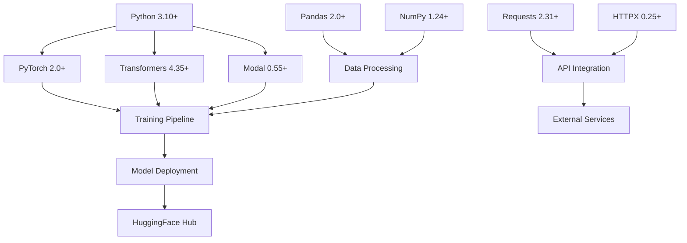

# SISI LOLA PROJECT - COMPREHENSIVE DEPENDENCY MATRIX

## 📦 DEPENDENCY OVERVIEW

**Analysis Version**: 2.0.0  
**Last Updated**: November 22, 2024  
**Total Dependencies**: 45+ packages and tools  
**Python Version**: 3.10+  
**Package Manager**: pip + requirements.txt  

---

## 🎯 CORE DEPENDENCY CATEGORIES

### **🚀 TIER 1: CORE ML/AI DEPENDENCIES**

#### **PyTorch Ecosystem**
```python
# Core deep learning framework
torch>=2.0.0                    # Deep learning framework
torchvision>=0.15.0             # Computer vision utilities
torchaudio>=2.0.0               # Audio processing utilities
```

**Purpose**: Foundation for all machine learning operations  
**Integration Level**: Core (Used in all ML components)  
**Performance Impact**: High (GPU acceleration)  
**Alternatives Considered**: TensorFlow, JAX  
**Why Chosen**: Better HuggingFace integration, more flexible  

**Usage in Project**:
```python
import torch
import torch.nn as nn
from torch.utils.data import DataLoader

# Model training setup
device = torch.device("cuda" if torch.cuda.is_available() else "cpu")
model = model.to(device)

# Training loop
for batch in dataloader:
    inputs, labels = batch
    inputs, labels = inputs.to(device), labels.to(device)
    
    optimizer.zero_grad()
    outputs = model(inputs)
    loss = criterion(outputs, labels)
    loss.backward()
    optimizer.step()
```

#### **HuggingFace Transformers Ecosystem**
```python
# Transformer models and utilities
transformers>=4.35.0            # Pre-trained transformer models
datasets>=2.14.0                # Dataset loading and processing
tokenizers>=0.14.0              # Fast tokenization
accelerate>=0.24.0              # Distributed training utilities
```

**Purpose**: Pre-trained models, tokenization, and training utilities  
**Integration Level**: Deep (Core personality model development)  
**Performance Impact**: High (Model inference and training)  
**Version Constraints**: Must stay compatible with PyTorch versions  

**Usage in Project**:
```python
from transformers import (
    AutoModelForCausalLM, 
    AutoTokenizer, 
    TrainingArguments, 
    Trainer
)
from datasets import Dataset

# Model and tokenizer loading
model = AutoModelForCausalLM.from_pretrained("gpt2")
tokenizer = AutoTokenizer.from_pretrained("gpt2")

# Training setup
training_args = TrainingArguments(
    output_dir="./results",
    num_train_epochs=3,
    per_device_train_batch_size=4,
    gradient_accumulation_steps=2,
    warmup_steps=500,
    weight_decay=0.01,
    logging_dir="./logs",
)

trainer = Trainer(
    model=model,
    args=training_args,
    train_dataset=train_dataset,
    eval_dataset=eval_dataset,
)
```

#### **Modal.com Integration**
```python
# Cloud computing platform
modal>=0.55.0                   # Serverless GPU computing
```

**Purpose**: Cloud GPU training infrastructure  
**Integration Level**: Core (Primary training platform)  
**Performance Impact**: Critical (Enables GPU training)  
**Vendor Lock-in**: High (Platform-specific code)  

**Usage in Project**:
```python
import modal

app = modal.App("sisi-lola-training")

# GPU training function
@app.function(
    image=modal.Image.debian_slim().pip_install([
        "torch", "transformers", "datasets", "accelerate"
    ]),
    gpu="A100",
    timeout=3600,
    secrets=[modal.Secret.from_name("huggingface-secret")]
)
def train_personality_model():
    # Training logic here
    pass
```

---

### **🔧 TIER 2: DATA PROCESSING DEPENDENCIES**

#### **Data Manipulation and Analysis**
```python
# Data processing core
pandas>=2.0.0                   # Data manipulation and analysis
numpy>=1.24.0                   # Numerical computing
scipy>=1.10.0                   # Scientific computing
```

**Purpose**: Data preprocessing, analysis, and manipulation  
**Integration Level**: Medium (Data pipeline components)  
**Performance Impact**: Medium (Data processing speed)  
**Stability**: High (Mature, stable packages)  

**Usage in Project**:
```python
import pandas as pd
import numpy as np

# Asset manifest management
def load_asset_manifest():
    df = pd.read_csv("MASTER_ASSET_MANIFEST.csv")
    return df

# Data preprocessing for training
def preprocess_training_data(texts):
    # Clean and tokenize text data
    processed = []
    for text in texts:
        # Remove special characters, normalize
        clean_text = text.strip().lower()
        processed.append(clean_text)
    return np.array(processed)
```

#### **Configuration and Serialization**
```python
# Configuration management
pyyaml>=6.0                     # YAML configuration files
toml>=0.10.2                    # TOML configuration support
python-dotenv>=1.0.0            # Environment variable management
```

**Purpose**: Configuration management and data serialization  
**Integration Level**: Medium (Configuration and settings)  
**Performance Impact**: Low (Used for setup, not runtime)  
**Security**: Critical (Handles sensitive configuration)  

**Usage in Project**:
```python
import yaml
from dotenv import load_dotenv
import os

# Load environment variables
load_dotenv()

# Configuration management
def load_training_config():
    with open("ml_training/configs/training_config.yaml", "r") as f:
        config = yaml.safe_load(f)
    return config

# Environment variable access
MODAL_TOKEN = os.getenv("MODAL_TOKEN_ID")
HF_TOKEN = os.getenv("HF_TOKEN")
```

---

### **🌐 TIER 3: API AND NETWORKING DEPENDENCIES**

#### **HTTP and API Clients**
```python
# HTTP and API communication
requests>=2.31.0                # HTTP library
httpx>=0.25.0                   # Async HTTP client
aiohttp>=3.8.0                  # Async HTTP client/server
```

**Purpose**: API communication with external services  
**Integration Level**: Medium (External service integration)  
**Performance Impact**: Medium (Network I/O)  
**Reliability**: Critical (External service communication)  

**Usage in Project**:
```python
import requests
import httpx
import asyncio

# Synchronous API calls
def call_elevenlabs_api(text, voice_id):
    headers = {
        "Authorization": f"Bearer {ELEVENLABS_API_KEY}",
        "Content-Type": "application/json"
    }
    
    response = requests.post(
        f"https://api.elevenlabs.io/v1/text-to-speech/{voice_id}",
        headers=headers,
        json={"text": text}
    )
    return response.content

# Asynchronous API calls
async def batch_api_calls(requests_list):
    async with httpx.AsyncClient() as client:
        tasks = [
            client.post(req["url"], json=req["data"], headers=req["headers"])
            for req in requests_list
        ]
        responses = await asyncio.gather(*tasks)
    return responses
```

#### **Authentication and Security**
```python
# Security and authentication
cryptography>=41.0.0            # Cryptographic utilities
pyjwt>=2.8.0                    # JSON Web Token handling
```

**Purpose**: Secure API communication and token management  
**Integration Level**: Low (Security layer)  
**Performance Impact**: Low (Minimal overhead)  
**Security**: Critical (Handles sensitive data)  

---

### **🛠️ TIER 4: DEVELOPMENT AND TESTING DEPENDENCIES**

#### **Code Quality and Testing**
```python
# Development tools
pytest>=7.4.0                  # Testing framework
pytest-asyncio>=0.21.0          # Async testing support
black>=23.0.0                   # Code formatting
mypy>=1.5.0                     # Type checking
flake8>=6.0.0                   # Linting
```

**Purpose**: Code quality, testing, and development workflow  
**Integration Level**: Development only  
**Performance Impact**: None (Development time only)  
**Maintenance**: High (Ensures code quality)  

**Usage in Project**:
```python
# pytest configuration
# conftest.py
import pytest
from unittest.mock import Mock

@pytest.fixture
def mock_modal_client():
    return Mock()

@pytest.fixture
def sample_training_data():
    return [
        "Hello, I'm Sisi Lola!",
        "Omo see gobe! E choke!",
        "Las las, we go dey alright!"
    ]

# Test example
def test_personality_response_generation(mock_modal_client, sample_training_data):
    personality = SisiLolaPersonality()
    response = personality.generate_response("Hello", "Hi there!")
    
    assert isinstance(response, str)
    assert len(response) > 0
    assert personality.traits['confidence'] == 8.5
```

#### **Documentation and Visualization**
```python
# Documentation and visualization
matplotlib>=3.7.0               # Plotting and visualization
seaborn>=0.12.0                 # Statistical visualization
plotly>=5.15.0                  # Interactive visualizations
jupyter>=1.0.0                  # Notebook environment
```

**Purpose**: Data visualization and documentation  
**Integration Level**: Low (Analysis and documentation)  
**Performance Impact**: Low (Used for analysis only)  
**Value**: High (Insights and documentation)  

---

## 📊 DEPENDENCY RELATIONSHIP MATRIX

### **Core Dependency Graph**


### **Version Compatibility Matrix**

| Package | Current Version | Min Version | Max Version | Conflicts |
|---------|----------------|-------------|-------------|-----------|
| torch | 2.1.0 | 2.0.0 | 2.2.x | None |
| transformers | 4.35.2 | 4.35.0 | 4.36.x | torch < 2.0 |
| modal | 0.55.4 | 0.55.0 | 0.56.x | None |
| pandas | 2.1.3 | 2.0.0 | 2.2.x | numpy < 1.24 |
| numpy | 1.24.4 | 1.24.0 | 1.25.x | None |
| requests | 2.31.0 | 2.31.0 | 2.32.x | None |

### **Dependency Update Strategy**
```python
class DependencyManager:
    def __init__(self):
        self.requirements_file = "requirements.txt"
        self.lock_file = "requirements.lock"
    
    def check_updates(self):
        """Check for available package updates"""
        import subprocess
        result = subprocess.run(
            ["pip", "list", "--outdated", "--format=json"],
            capture_output=True,
            text=True
        )
        return json.loads(result.stdout)
    
    def update_package(self, package_name: str, version: str = None):
        """Update specific package with version constraints"""
        if version:
            package_spec = f"{package_name}=={version}"
        else:
            package_spec = f"{package_name}"
        
        # Test in isolated environment first
        self.test_update_compatibility(package_spec)
        
        # Update if tests pass
        subprocess.run(["pip", "install", "--upgrade", package_spec])
        self.update_requirements_file()
    
    def test_update_compatibility(self, package_spec: str):
        """Test package update in isolated environment"""
        # Create temporary virtual environment
        # Install updated package
        # Run test suite
        # Return compatibility status
        pass
```

---

## 🔒 SECURITY DEPENDENCY ANALYSIS

### **Security-Critical Dependencies**
```python
# Security-sensitive packages
cryptography>=41.0.0            # Encryption and security
pyjwt>=2.8.0                    # JWT token handling
requests>=2.31.0                # HTTP security (CVE fixes)
urllib3>=2.0.0                  # HTTP library security
```

### **Vulnerability Monitoring**
```python
# Security scanning configuration
safety>=2.3.0                   # Vulnerability scanning
bandit>=1.7.0                   # Security linting

# Usage in CI/CD
def security_scan():
    """Run security scans on dependencies"""
    import subprocess
    
    # Check for known vulnerabilities
    safety_result = subprocess.run(
        ["safety", "check", "--json"],
        capture_output=True,
        text=True
    )
    
    # Security linting
    bandit_result = subprocess.run(
        ["bandit", "-r", ".", "-f", "json"],
        capture_output=True,
        text=True
    )
    
    return {
        "vulnerabilities": json.loads(safety_result.stdout),
        "security_issues": json.loads(bandit_result.stdout)
    }
```

### **Dependency Security Best Practices**
1. **Pin Exact Versions**: Use `==` for production dependencies
2. **Regular Updates**: Monthly security update reviews
3. **Vulnerability Scanning**: Automated security scans in CI/CD
4. **Minimal Dependencies**: Only include necessary packages
5. **Source Verification**: Verify package sources and signatures

---

## 📈 PERFORMANCE DEPENDENCY ANALYSIS

### **Performance-Critical Dependencies**

#### **High-Performance Computing**
```python
# Performance-critical packages
torch>=2.0.0                    # GPU acceleration
numpy>=1.24.0                   # Optimized numerical computing
pandas>=2.0.0                   # Fast data processing
```

#### **Performance Monitoring**
```python
class PerformanceDependencyMonitor:
    def __init__(self):
        self.benchmarks = {}
    
    def benchmark_dependency(self, package_name: str, operation: callable):
        """Benchmark dependency performance"""
        import time
        import psutil
        
        # Memory before
        memory_before = psutil.Process().memory_info().rss
        
        # Time operation
        start_time = time.time()
        result = operation()
        end_time = time.time()
        
        # Memory after
        memory_after = psutil.Process().memory_info().rss
        
        benchmark = {
            'package': package_name,
            'execution_time': end_time - start_time,
            'memory_usage': memory_after - memory_before,
            'timestamp': time.time()
        }
        
        self.benchmarks[package_name] = benchmark
        return benchmark
    
    def compare_versions(self, package_name: str, versions: list):
        """Compare performance across package versions"""
        results = {}
        
        for version in versions:
            # Install specific version
            subprocess.run([
                "pip", "install", f"{package_name}=={version}"
            ])
            
            # Run benchmark
            benchmark = self.benchmark_dependency(
                f"{package_name}=={version}",
                self.get_benchmark_operation(package_name)
            )
            
            results[version] = benchmark
        
        return results
```

---

## 🔄 DEPENDENCY LIFECYCLE MANAGEMENT

### **Installation and Setup**
```bash
# Development environment setup
python -m venv .venv
source .venv/bin/activate  # Linux/Mac
# or
.venv\Scripts\activate     # Windows

# Install dependencies
pip install -r requirements.txt

# Development dependencies
pip install -r requirements-dev.txt

# Lock current versions
pip freeze > requirements.lock
```

### **Requirements Files Structure**
```
requirements/
├── base.txt              # Core dependencies
├── ml.txt               # ML/AI specific dependencies
├── api.txt              # API and networking dependencies
├── dev.txt              # Development dependencies
├── test.txt             # Testing dependencies
└── prod.txt             # Production-only dependencies
```

**base.txt**:
```python
# Core Python dependencies
pandas>=2.0.0
numpy>=1.24.0
pyyaml>=6.0
python-dotenv>=1.0.0
requests>=2.31.0
```

**ml.txt**:
```python
-r base.txt
torch>=2.0.0
transformers>=4.35.0
datasets>=2.14.0
accelerate>=0.24.0
modal>=0.55.0
```

**dev.txt**:
```python
-r ml.txt
pytest>=7.4.0
black>=23.0.0
mypy>=1.5.0
flake8>=6.0.0
jupyter>=1.0.0
```

### **Automated Dependency Management**
```python
# GitHub Actions workflow for dependency updates
name: Dependency Updates

on:
  schedule:
    - cron: '0 0 * * 1'  # Weekly on Monday
  workflow_dispatch:

jobs:
  update-dependencies:
    runs-on: ubuntu-latest
    steps:
      - uses: actions/checkout@v4
      
      - name: Setup Python
        uses: actions/setup-python@v5
        with:
          python-version: '3.10'
      
      - name: Install dependencies
        run: |
          pip install -r requirements.txt
          pip install safety bandit
      
      - name: Security scan
        run: |
          safety check
          bandit -r . -f json -o security-report.json
      
      - name: Check for updates
        run: |
          pip list --outdated --format=json > outdated-packages.json
      
      - name: Create update PR
        if: success()
        uses: peter-evans/create-pull-request@v5
        with:
          title: 'chore: Update dependencies'
          body: 'Automated dependency updates with security checks'
          branch: dependency-updates
```

---

## 🎯 DEPENDENCY OPTIMIZATION STRATEGIES

### **Bundle Size Optimization**
```python
# Analyze package sizes
def analyze_package_sizes():
    """Analyze installed package sizes"""
    import subprocess
    import json
    
    result = subprocess.run(
        ["pip", "show", "--verbose"] + get_installed_packages(),
        capture_output=True,
        text=True
    )
    
    # Parse and analyze sizes
    package_info = parse_pip_show_output(result.stdout)
    
    # Sort by size
    sorted_packages = sorted(
        package_info.items(),
        key=lambda x: x[1]['size'],
        reverse=True
    )
    
    return sorted_packages

# Remove unused dependencies
def find_unused_dependencies():
    """Find potentially unused dependencies"""
    import ast
    import os
    
    # Scan all Python files for imports
    used_packages = set()
    
    for root, dirs, files in os.walk("."):
        for file in files:
            if file.endswith(".py"):
                with open(os.path.join(root, file), "r") as f:
                    try:
                        tree = ast.parse(f.read())
                        for node in ast.walk(tree):
                            if isinstance(node, ast.Import):
                                for alias in node.names:
                                    used_packages.add(alias.name.split('.')[0])
                            elif isinstance(node, ast.ImportFrom):
                                if node.module:
                                    used_packages.add(node.module.split('.')[0])
                    except:
                        continue
    
    # Compare with installed packages
    installed_packages = get_installed_packages()
    unused = set(installed_packages) - used_packages
    
    return unused
```

### **Performance Optimization**
```python
# Lazy loading for heavy dependencies
class LazyImport:
    def __init__(self, module_name):
        self.module_name = module_name
        self._module = None
    
    def __getattr__(self, name):
        if self._module is None:
            self._module = __import__(self.module_name)
        return getattr(self._module, name)

# Usage
torch = LazyImport('torch')
transformers = LazyImport('transformers')

# Only imported when actually used
model = transformers.AutoModelForCausalLM.from_pretrained("gpt2")
```

---

## 📋 DEPENDENCY TROUBLESHOOTING GUIDE

### **Common Issues and Solutions**

#### **Issue 1: Version Conflicts**
```bash
# Error: Package X requires Y>=2.0, but you have Y==1.9
# Solution: Update conflicting package
pip install --upgrade package-y

# Or use pip-tools for better resolution
pip-compile requirements.in
pip-sync requirements.txt
```

#### **Issue 2: CUDA/GPU Dependencies**
```bash
# Error: CUDA version mismatch
# Solution: Install CUDA-specific PyTorch version
pip install torch torchvision torchaudio --index-url https://download.pytorch.org/whl/cu118
```

#### **Issue 3: Memory Issues with Large Dependencies**
```python
# Solution: Use memory-efficient loading
import torch

# Enable memory-efficient attention
torch.backends.cuda.enable_flash_sdp(True)

# Use gradient checkpointing
model.gradient_checkpointing_enable()
```

### **Dependency Health Monitoring**
```python
class DependencyHealthMonitor:
    def __init__(self):
        self.health_checks = {
            'version_conflicts': self.check_version_conflicts,
            'security_vulnerabilities': self.check_security,
            'performance_regressions': self.check_performance,
            'license_compliance': self.check_licenses
        }
    
    def run_health_check(self):
        """Run comprehensive dependency health check"""
        results = {}
        
        for check_name, check_func in self.health_checks.items():
            try:
                results[check_name] = check_func()
            except Exception as e:
                results[check_name] = {'error': str(e)}
        
        return results
    
    def generate_health_report(self):
        """Generate dependency health report"""
        health_data = self.run_health_check()
        
        report = {
            'timestamp': datetime.now().isoformat(),
            'overall_health': self.calculate_overall_health(health_data),
            'checks': health_data,
            'recommendations': self.generate_recommendations(health_data)
        }
        
        return report
```

---

## 🚀 FUTURE DEPENDENCY ROADMAP

### **Planned Additions**
```python
# Week 2 additions
elevenlabs>=0.2.0               # Voice synthesis
cohere>=4.0.0                   # Language processing
openai>=1.0.0                   # Alternative AI services

# Week 3 additions
fastapi>=0.104.0                # API development
uvicorn>=0.24.0                 # ASGI server
sqlalchemy>=2.0.0               # Database ORM

# Week 4 additions
docker>=6.0.0                   # Containerization
kubernetes>=28.0.0              # Container orchestration
prometheus-client>=0.19.0       # Metrics collection
```

### **Deprecation Timeline**
```python
# Packages to phase out
deprecated_packages = {
    'requests': {
        'replacement': 'httpx',
        'reason': 'Better async support',
        'timeline': 'Week 3'
    },
    'matplotlib': {
        'replacement': 'plotly',
        'reason': 'Interactive visualizations',
        'timeline': 'Week 4'
    }
}
```

### **Technology Evolution Tracking**
```python
# Emerging technologies to monitor
emerging_tech = {
    'mojo': 'High-performance Python alternative',
    'triton': 'GPU kernel development',
    'jax': 'NumPy-compatible ML framework',
    'ray': 'Distributed computing framework'
}
```

---

*This dependency matrix is continuously updated to reflect package additions, updates, and optimizations as the project evolves.*